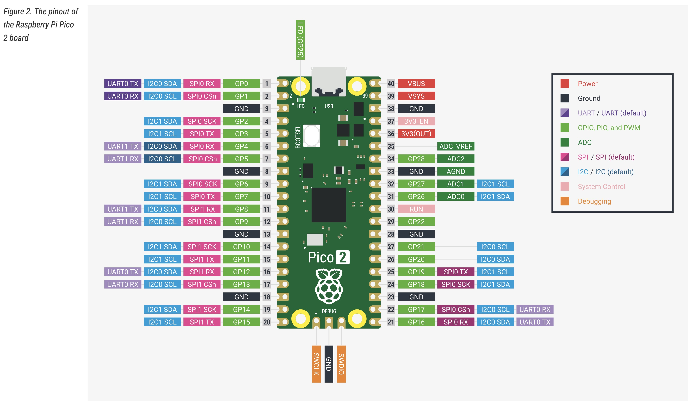
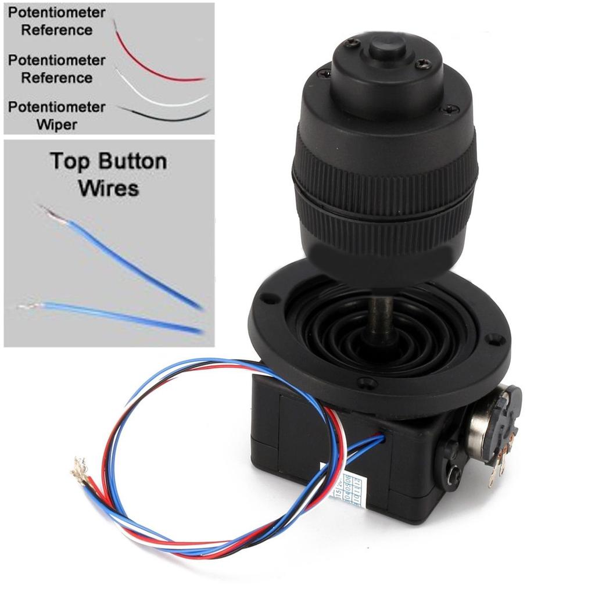

# 4 Axis USB Joystick

This is a simple USB Joystick written in [CircuitPython](https://circuitpython.org/), using the [Joystick_XL](https://github.com/fasteddy516/CircuitPython_JoystickXL) library.
Nothing particularly complex, most of the heavy lifting is done by Joystick_XL, but I'm making the repository public just in case anyone finds it useful

This is built for the Raspberry Pi Pico2 microcontroller. It should work with any other microcontroller that support USB and CircuitPython. It uses CircuitPython rather than MicroPython because it requires support for USB HID.

This uses the easily available Jh-D400X-R2 joystick ([Aliexpress](https://www.aliexpress.us/w/wholesale-Jh%2525252dD400X%2525252dR2-4-axis.html?spm=a2g0o.productlist.search.0), [Amazon](https://www.amazon.com/s?k=Jh-D400X-R2&crid=1CKJ3M0AV3JNP&sprefix=jh-d400x-r2%2Caps%2C95),...)

The current code supports a single button, using the button on top of the joystick. This could easily be extended to multiple buttons connected to the Pico2 GPIO ports

## Building

1. [Install CircuitPython](https://learn.adafruit.com/welcome-to-circuitpython/installing-circuitpython)
2. Clone the [Joystick_XL](https://github.com/fasteddy516/CircuitPython_JoystickXL) repository and copy the python files to the folder _joystick_xl_ on the board filesystem
3. Clone this repository and copy _boot.py_. _code.py_, and _config.py_ to the board filesystem
4. Wire up the joystick

The code assumes that the joystick is connected to the Pico2 as follows
<table>
<tr><td>GP3 (pin 5)</td><td>joystick button (blue wire)</td></tr>
<tr><td>3V3 (pin 36)</td><td>positive reference on joystick pots: red wire and left pot terminals</td></tr>
<tr><td>GND (pin 33)</td><td>other blue wire, black wire, and negative potentiometer reference (right pot terminals)</td></tr>
<tr><td>ADC2 (pin 34)</td><td>white wire</td></tr>
<tr><td>ADC1 (pin 32)</td><td>center terminal (wiper) on tilt pot</td></tr>
<tr><td>ADC0 (pin 31)</td><td>center terminal on pan pot</td></tr>
</table>

## Use

I use this with my [VISCA Game Controller](https://github.com/DanTappan/VISCA-Game-Controller) app for controlling Ethernet connected PTZ cameras. 

Under normal use, the code does not export the CircuitPython filesystem to the connected computer. If you want to edit the code, you can cause it to export the filesystem by holding down the joystick button for 5 seconds after plugging in the USB connector.

## Images

 

